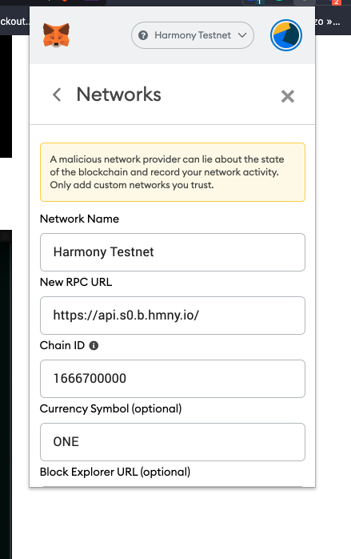
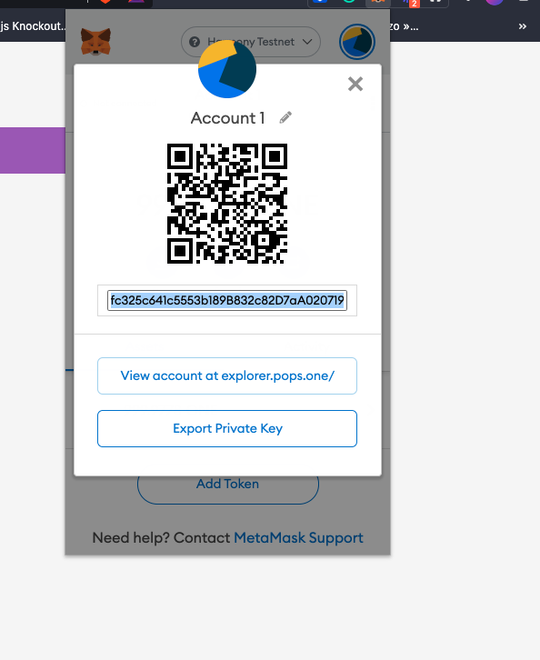

# Dapp starter kit

## Tech stack
- NextJS
- Tailwind
- Typescript
- Hardhat


## Steps to deploy your contract on Harmony testnet using Metamask
1. Add a new network on Metamask from metamask settings
   

2. Add test faucet in your account from 👇 URL
3. export your account secret key and paste it in `..secret` file at the root level.
   


4. Run `yarn run deploy:contract:testnet` to deploy contract on testnet
## Important commands


1. Start local Hardhat network
```
npx hardhat node
```

2. Get all accounts
```
npx hardhat accounts
```

3. Compile contracts
```
npx hardhat compile
```

4. Run test cases
```
npx hardhat test
```

5. Deploy contract on a network
```
npx hardhat run scripts/deploy.js --network <network-name>
```

## Steps to run project on local machine

1.Start local hardhat network in a separate terminal
- Add a `.secret` file (can be an empty file)
```
npx hardhat node
```
2. Deploy contract on local network
```
yarn run deploy:contract
```
This will put contract address in `./config.js` file. Please check `scripts/deploy.js` to change contract name.

3. Put Firebase config keys in `.env` file. check `.sample.env` file for more info. connect with Satyam to get keys.
4. Run `yarn run dev` to start application.

## Important Urls

1. Harmony mainnet URL 1: `https://api.s0.t.hmny.io`
2. Harmony mainnet URL 2: `https://api.harmony.one/`
3. Harmony testnet URL: `https://api.s0.b.hmny.io/`
4. Testnet Faucet URL:`https://faucet.pops.one/`, `https://onefaucet.ibriz.ai/`
1. Mainnet block explorer URL: `https://explorer.harmony.one/`
2. Testnet block explorer URL: `https://explorer.pops.one/`
3. To convert **bech32** address to Ethereum style hex address
`https://explorer.harmony.one/#/address/one1pdv9lrdwl0rg5vglh4xtyrv3wjk3wsqket7zxy`

4. Check Harmony Network status: `https://status.harmony.one/`
5. Component libray: https://ant.design/components


1. Main Parts:
   Smart contract
2. Front-end : what we see on the screen
3. Backend: Database, authentication, messaging, etc. 


Run
```yarn run deploy:contract:testnet```